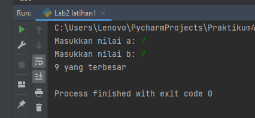
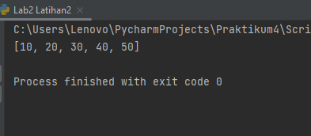
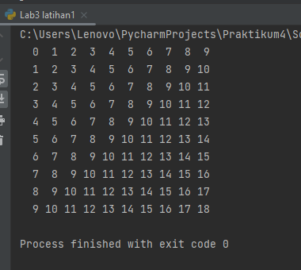
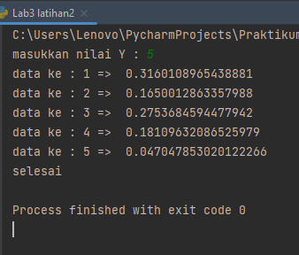
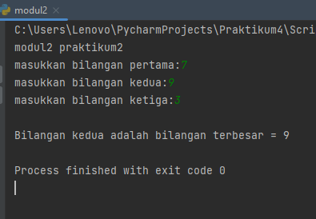
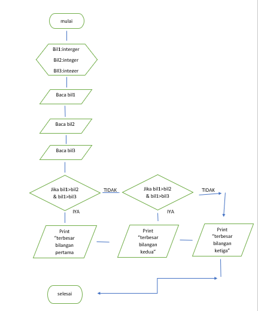
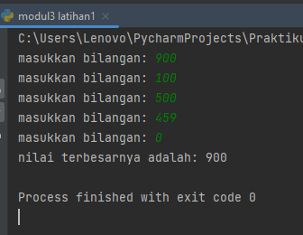
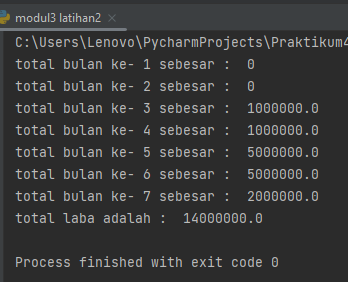

#PRAKTIKUMKE4
### uswatun hasanah
### 312210343

### praktikum4
### LAB 2: STRUKTUR KONDISI
### LAB2 LATIHAN 1
### MEMBUAT PROGRAM DENGAN 2 BUAH BILANGAN UNTUK MENENTUKAN BILANGAN TERBESAR MENGGUNAKAN STATMEN IF
berikut ini adalah source code lab2 Latihan 1

```
a = int(input('Masukkan nilai a: '))
b = int(input('Masukkan nilai b: '))

if a > b:
  print(a, 'yang terbesar')
else:
  print(b, 'yang terbesar')
```



### LAB2 LATIHAN 2
### MEMBUAT PROGRAM UNTUK MENGURUTKAN DATA SECARA BERURUTAN MULAI DARI DATA TERKECIL
berikut ini adalah source code Latihan 2

```
#inisialisasi variable luas dengan nilai berformat array
luas = [40,20,50,10,30]

#urutan data di dalam list dari yang terkecil ke yang terbesar
luas.sort()

#tampilkan nilai dari variable luas setelah pengurutan
print(luas)
[10,20,30,40,50]
```


### LAB3 LATIHAN 1
### MEMBUAT PROGRAM DENGAN PERULANGAN BERTINGKAT
berikut ini adalah source code latihan 3

```
for u in range(0, 10):
    for i in range(0, 10):
        product = u+i
        print(f"{product:>3}", end='')
    print()

```    



### LAB3 LATIHAN 2
### MEMBUAT PROGRAM BILANGAN ACAK YANG LEBIH KECIL 0.5 MENGGUNAKAN KOMBINASI WHILE DAN FOR
berikut ini adalah sorce code latihan 4

```
import random
y = int(input("masukkan nilai Y : "))
for u in range(y):
    a = random.uniform(0.0, 0.5)
    print("data ke :", u+1, "=> ", a)
print('selesai')

```



### MODUL PRAKTIKUM 2
### MEMBUAT PROGRAM DENGAN MENGINPUT 3 BUAH BILANGAN UNTUK MENENTUKAN BILANGAN TERBESAR MENGGUNAKAN STATEMEN IF
berikut ini adalah source code modul praktikum 2

```
print("modul2 praktikum2")

A = int (input("masukkan bilangan pertama:"))
B = int (input("masukkan bilangan kedua:"))
C = int (input("masukkan bilangan ketiga:"))

if A > B > C :
    print("\nBilangan pertama adalah bilanagn terbesar = %s" % A)
elif B > C :
    print("\nBilangan kedua adalah bilangan terbesar = %s" % B)
else :
    print("\nBilangan ketiga adalah bilangan terbesar = %s" % C)

```




### FLOWCHART 
1. MULAI
2. INISIASI BIL1, BIL2, BIL3 SEBAGAI INTEGER.
BACA BIL1
BACA BIL2
BACA BILL3
JIKA BIL1 > BIL2 DAN BIL1 > BIL3 MAKA KERJAKAN LANGKAH 8, SELAIN ITU
JIKA BIL2 > BIL1 DAN BIL2 > BIL3 MAKA KERJAKAN LANGKAH 9, SELAIN ITU KERJAKAN LANGKAH 10.
CETAK "BILANGAN TERBESAR BILANGAN PERTAMA".
CETAK "BILANGAN TERBESAR BILANGAN KEDUA".
CETAK "BILANGAN TERBESAR BILANGAN KETIGA".
SELESAI.




### MODUL PRAKTIKUM 3
### MEMBUAT PROGRAM SEDERHANA DENGAN PERULANGAN 
Berikut ini adalah source code modul praktikum 3

```
n=1
a=0
while n !=0:

    if n > a:
        a = n
    n = int(input("masukkan bilangan: "))

    if n == 0:
        break
print("nilai terbesarnya adalah:", a)
```



### MODUL PRAKTIKUM 3
berikut ini adalah source code modul praktikum 3

```
n = 100000000
sum = 0
u = 0
laba = [int(0), int(0), int(n) * 0.01, int(n) * 0.01, int(n) * 0.05, int(n) * 0.05, int(n) * 0.02]
for i in laba:
    sum = sum+i
    u +=1
    print('total bulan ke-', u, 'sebesar : ', i)
print('total laba adalah : ',sum)
```


